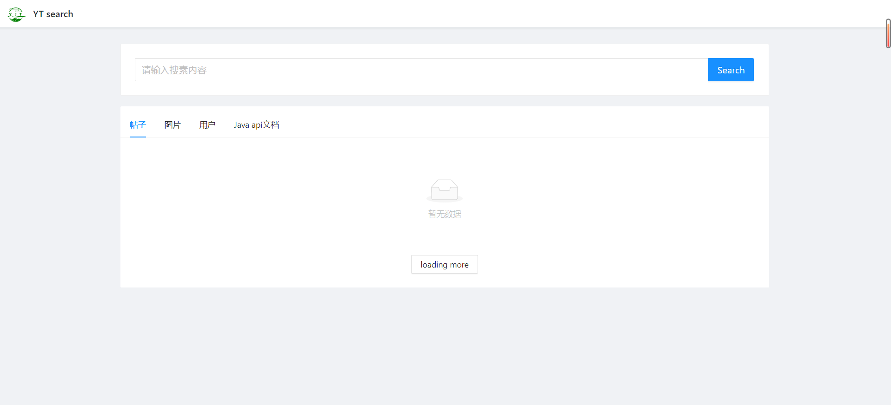
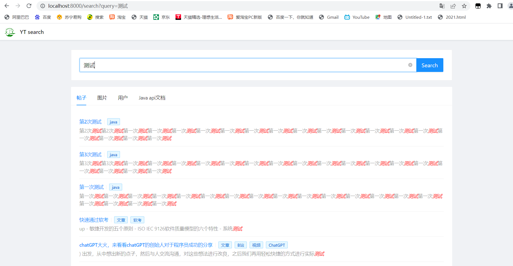
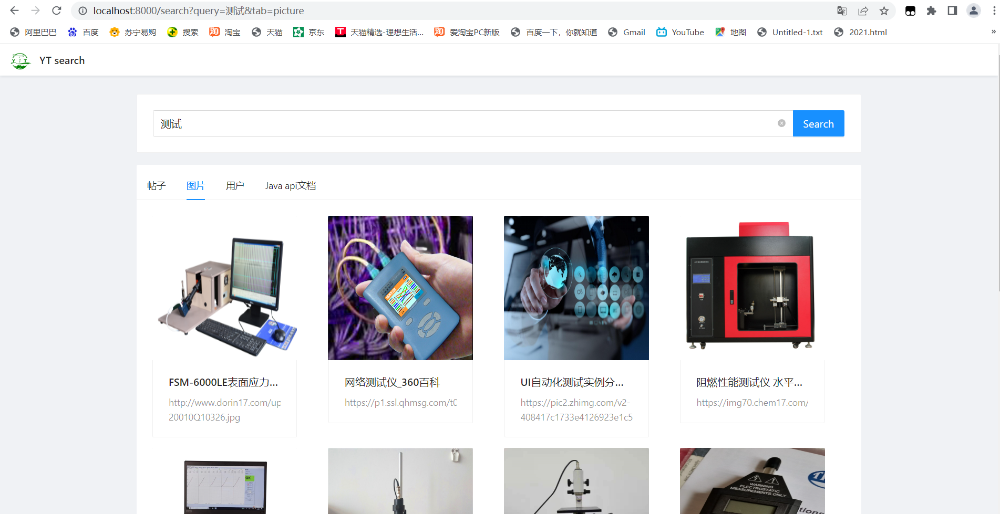
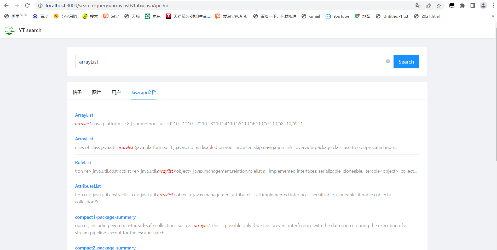
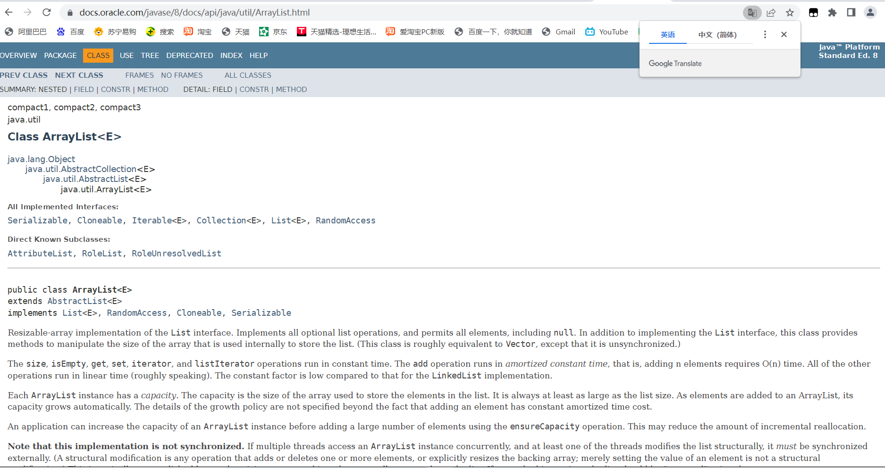

# 重构的搜索中台项目

## 项目介绍：

基于Spring Boot + Elastic Stack + dubbo (+ Vue3) 的搜索中台，用户可以在同一页面集中搜索出不同来源，不同类型的内容，如文章，图片，用户，Java api文档等，提升搜索体验

## 项目架构：

### 前端：

1. 基于 React + Ant Design Pro 进行开发，基于Tab组件和，使用aHook库中的use-url-state 钩子函数实现统一页面布局，通过用户点击Tab时更改路由来切换各类数据的搜索结果，并选用不同的组件进行展示
2. 为解决刷新页面后搜索结果丢失的问题，定义一个useUrlState类型数据，和url上的数据绑定，将页面上的tab同步到url上，用url来存储页面的状态

### 后端：

#### 数据源获取：

##### post和user中的数据

之前存储在数据库中的一些文章

##### picture中的数据

1. 通过Hutool的HttpRequest请求库将搜索结果页面爬取下来
2. 通过jsoup实时请求bing搜索结果获取图片，并使用CSS Selector语法解析和预处理图片信息，最终返回给前端

##### Java api文档的数据：

1. 扫描本地的API文档，分析文档内容并构建正排+倒排索引（使用ansj分词）
2. 为提高API扫描效率，使用多线程的方式对API文档进行分析扫描，在构建倒排索引的时候进行加锁，防止出现线程不安全问题
3. docInfo数据存入MySQL数据库中，以id作为索引，将倒排索引存入redis的hash数据结构中
4. 为提升构建索引的效率，不每次解析一条数据就插入一次数据库，而是解析完所有的搜索结果后将搜索结果统一进行批量插入数据库，使得构建索引的时间从一分多钟缩减到不到20s，**提升了三倍以上的效率**
5. 在得到一个搜索词后，先取redis查找倒排索引得到构建的文章id，然后使用优先队列合并搜索结果（docId的集合）,将docId的集合再去数据库中进行查找，得到搜索的结果

#### 项目特殊点：

1. 为实现多类型数据源的整体搜索，便于之后项目的拓展，使用门面模式在后端对前端发来的请求进行统一处理
2. 为提高聚合搜索接口的通用性首先通过定义数据源接口来实现统一的数据源接入标准（比如新数据源必须支持分页等），当新的数据源要接入的时候，只需要使用适配器对其数据查询的接口进行封装、以适配数据源接口，无需修改原有的代码，提高系统可拓展性
3. 为减少代码的圈复杂度，使用注册器模式代替if else来管理多个数据源对象，调用方可以根据名称轻松获取对象
4. 使用了dubbo高性能的RPC服务框架，实现了不同模块之间的通信，使得其他数据源可以快速接入搜索中台，提升效率
5. 为提升搜索体验，在本地搭建Elasticsearch来代替MySql的模糊查询，并通过为索引绑定ik分词器实现了更灵活的分词搜索
6. 搭建Kibana并配置index看板，实现对文章数据的可视化管理
7. Java代码中使用Spring Data Elasticsearch的QueryBuilder组合查询条件，实现对ES内文章的灵活查询
8. 使用Redis对查询数据进行缓存，提升查询性能

最终效果图：

输入搜索词：

直接切换标签进行搜索：

刷新页面能够保持页面状态

### Java的api文档搜索：

由于使用了dubbo，通过前后端简单的修改可以快速接入其他的tab进行搜索

点击快速跳转：

## 后续可开发的点：

记录并统计用户的搜索词，从而实现热搜、词云图、看板分析等功能